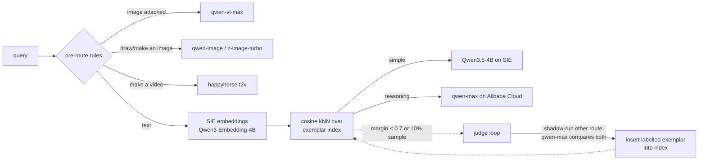

# Darwin Router

A **self-improving semantic router**, built in one day at the Superlinked × Qwen
hackathon (14 Aug 2026).

Most LLM routers need training runs to adapt, but models and traffic change
faster than retraining cycles. Darwin is **training-free**: routing decisions
are kNN lookups over a vector index of labelled exemplars, so adaptation is
literally an index write. Misroutes detected by an LLM-as-judge are written
back into the index — the router improves online, live, with no training loop.

## How it works



- **SIE (Superlinked Inference Engine)** is the core: every text request is
  embedded with `Qwen/Qwen3-Embedding-4B`, and the cheap lane is served by
  `Qwen/Qwen3.5-4B` on SIE.
- **Alibaba Cloud Model Studio** is the offload tier: `qwen-max` for reasoning,
  `qwen-vl-max` for vision, `z-image-turbo`/`qwen-image-3.0-pro` for images,
  `happyhorse-1.1-t2v` for video.
- **The Darwin loop**: uncertain routings (low kNN margin, or a 10% random
  sample) trigger an async shadow-run of the alternative route. qwen-max judges
  both real responses blind (A/B, randomized order). On a clear verdict the
  query is inserted into the index as a new exemplar — with poisoning guards
  (dedup at cosine ≥ 0.95, per-route caps, immutable bootstrap exemplars).
- **Honest evaluation**: a hand-written 40-query holdout replays against the
  live index every 30 minutes. Eval traffic hits a decision-only endpoint and
  can never enter the index — the accuracy curve is learning, not memorisation.
- The judge applies an **adequacy rule**: if the cheap model's answer is good
  enough, the correct route is the cheap one — quality per dollar, not maximum
  quality.

## Run it

```bash
uv sync
cp .env.example .env       # add SIE_API_KEY and DASHSCOPE_API_KEY
uv run python -m router.bootstrap        # cold-start ~40 exemplars
uv run uvicorn router.proxy:app --port 8787
uv run python -m router.replay --loop &  # 30-min holdout snapshots
open http://127.0.0.1:8787/              # live dashboard
```

Send it OpenAI-shaped traffic:

```bash
curl -s localhost:8787/v1/chat/completions -H 'Content-Type: application/json' \
  -d '{"model":"darwin","messages":[{"role":"user","content":"hey there!"}]}'
```

Responses carry an `x_darwin` block: route, kNN margin, model, latency, cost
estimate, and the all-qwen-max counterfactual cost.

## Repo map

| path | what |
|---|---|
| `router/proxy.py` | FastAPI proxy: pre-route → embed → kNN → dispatch → log |
| `router/index.py` | in-memory exemplar store, cosine kNN, JSONL persistence |
| `router/judge.py` | the Darwin loop: gate, shadow-run, blind judge, guarded insert |
| `router/replay.py` | immutable holdout replay + index snapshots |
| `router/bootstrap.py` | LLM-generated cold-start exemplars |
| `dashboard/index.html` | live dashboard (Chart.js, polls `/stats` every 2s) |
| `data/holdout.jsonl` | hand-written eval set — never enters the index |

No database, no vector store, no training infra: numpy + JSONL files.

*Costs shown are hardcoded estimates ($/1M tokens). Built with Claude Code.*
